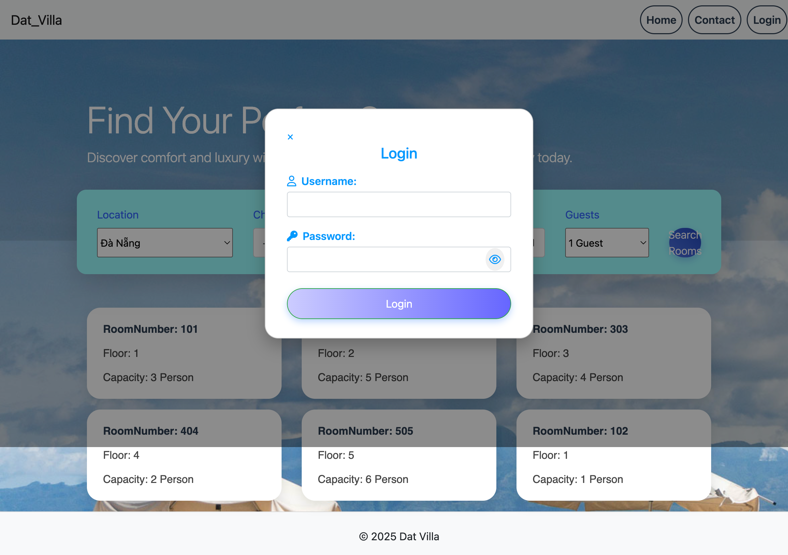
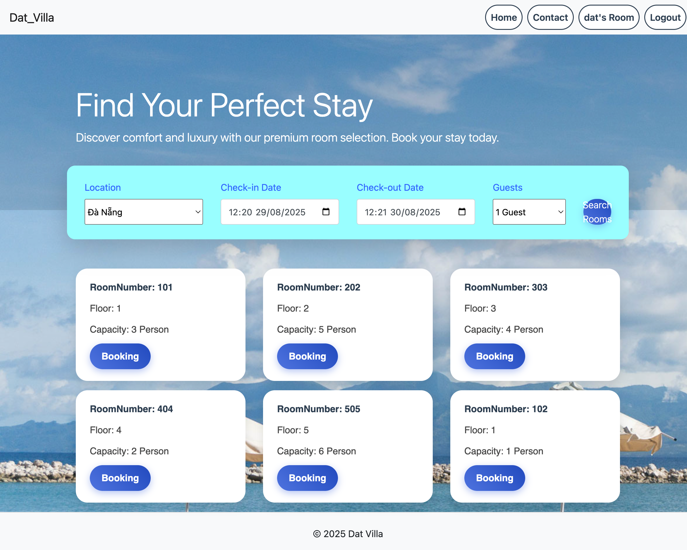
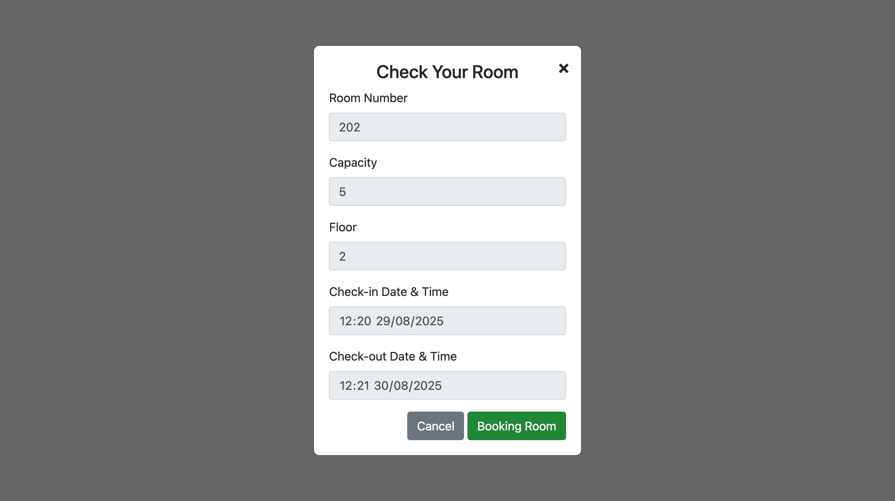
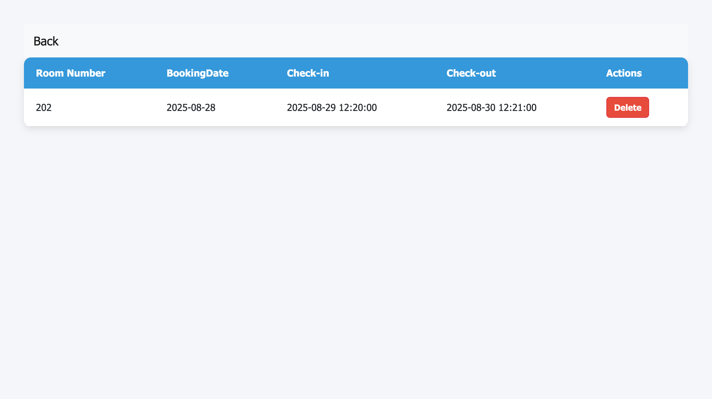

# 🏨 Hotel Booking System

## 📖 Introduction
This project is a **Hotel Room Booking System** developed as part of **PRJ301 - Workshop 2**.  
It is a simple web-based application that allows users to register, log in, view available rooms, and make reservations.  
The system is built with **Java (JSP/Servlet, MVC, JDBC)** and connected to a relational database.

## 🚀 Features
- 🔑 User authentication (Register / Login / Logout)
- 🛏️ View available rooms
- 📅 Make a room reservation
- 📋 Manage bookings (view / cancel reservation)
- 🛠️ Admin functions (add / edit / delete rooms)

## 🛠️ Technologies Used
- **Java** (JSP, Servlet, MVC Pattern)
- **JDBC** for database connection
- **SQL Server / MySQL** (depending on configuration)
- **HTML, CSS, Bootstrap, JSTL**
- **Apache Tomcat** (for deployment)

## 📂 Project Structure
Workshop2/

┣ src/ # Java source code (Controller, DAO, Model)

┣ web/ # JSP pages (View)

┣ database/ # SQL scripts for database schema

┣ README.md

┗ build.xml / pom.xml # Build file (Ant/Maven)
## 📸 Screenshots

### 🔑 Login Page

### 🛏️ Room List

### 📅 Booking Page

